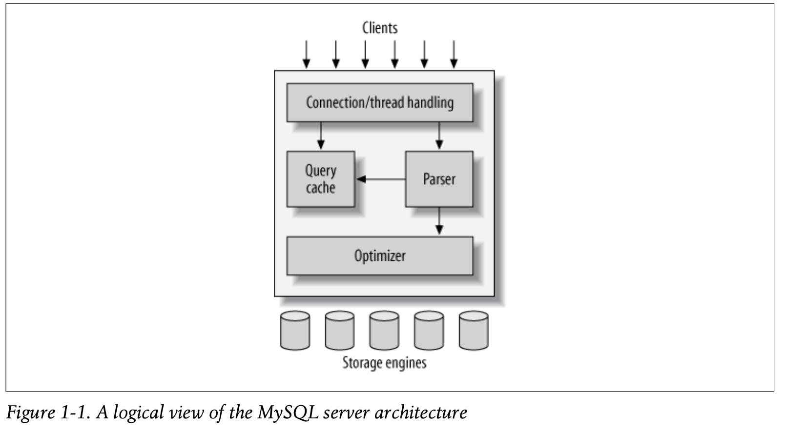

## MySQL's Logical Architecture



- The topmost layer contains the services that aren’t unique to MySQL. They’re services most network-based client/server tools or servers need: connection handling, authen- tication, security, and so forth.
- The second layer: Much of MySQL’s brains are here, including the code for query parsing, analysis, optimization, caching, and all the built-in functions (e.g., dates, times, math, and encryption). Any functionality provided across storage engines lives at this level: stored procedures, triggers, and views, for example.
- The third layer contains the storage engines. They are responsible for storing and retrieving all data stored “in” MySQL. The server communi- cates with them through the *storage engine API*. The API contains a couple of dozen low-level functions that perform operations such as “begin a transaction” or “fetch the row that has this primary key.” The storage engines don’t parse SQL1 or communicate with each other; they simply respond to requests from the server.

## Connection Management and Security

Each client connection gets its own thread within the server process. The connection’s queries execute within that single thread, which in turn resides on one core or CPU. The server caches threads, so they don’t need to be created and destroyed for each new connection.

*(MySQL 5.5 and newer versions support an API that can accept thread-pooling plugins, so a small pool of threads can service many connections.)*

When clients (applications) connect to the MySQL server, the server needs to authen- ticate them. Authentication is based on username, originating host, and password.

## Optimization and Execution

MySQL parses queries to create an internal structure (the parse tree), and then applies a variety of optimizations. These can include rewriting the query, determining the order in which it will read tables, choosing which indexes to use, and so on.

Before even parsing the query, though, the server consults the query cache, which can store only SELECT statements, along with their result sets. If anyone issues a query that’s identical to one already in the cache, the server doesn’t need to parse, optimize, or execute the query at all—it can simply pass back the stored result set.

## Concurrency Control

Anytime more than one query needs to change data at the same time, the problem of concurrency control arises. For our purposes in this chapter, MySQL has to do this at two levels: the server level and the storage engine level.

*We’ll use an email box on a Unix system as an example. The classic **mbox** file format is very simple. All the messages in an **mbox** mailbox are concatenated together, one after another. This makes it very easy to read and parse mail messages. It also makes mail delivery easy: just append a new message to the end of the file.*

*But what happens when two processes try to deliver messages at the same time to the same mailbox? Clearly that could corrupt the mailbox, leaving two interleaved mes- sages at the end of the mailbox file. Well-behaved mail delivery systems use locking to prevent corruption. If a client attempts a second delivery while the mailbox is locked, it must wait to acquire the lock itself before delivering its message.*

This scheme works reasonably well in practice, but it gives no support for concurrency. Because only a single process can change the mailbox at any given time, this approach becomes problematic with a high-volume mailbox.

#### 1. Read/Write Locks

Systems that deal with concurrent read/write access typically implement a locking system that consists of two lock types. These locks are usually known as *shared locks* and *exclusive locks*, or *read locks* and *write locks*.

- **Read Locks**: Read locks on a resource are shared, or mutually nonblocking: many clients can read from a resource at the same time and not interfere with each other.
- **Write Locks**: On the other hand, are exclusive. They block both read locks and other write locks—because the only safe policy is to have a single client writing to the resource at a given time and to prevent all reads when a client is writing.

#### 2. Lock Granularity

One way to improve the concurrency of a shared resource is to be more selective about what you lock. Rather than locking the entire resource, lock only the part that contains the data you need to change.

The problem is locks consume resources. Every lock operation—getting a lock, check- ing to see whether a lock is free, releasing a lock, and so on—has overhead.

##### a. Table Locks

The most basic locking strategy available in MySQL, and the one with the lowest over- head.

When a client wishes to write to a table (insert, delete, update, etc.), it acquires a write lock. This keeps all other read and write operations at bay. When nobody is writing, readers can obtain read locks, which don’t conflict with other read locks.

Write locks also have a higher priority than read locks, so a request for a write lock will advance to the front of the lock queue even if readers are already in the queue (write locks can advance past read locks in the queue, but read locks cannot advance past write locks).

Although storage engines can manage their own locks, MySQL itself also uses a variety of locks that are effectively table-level for various purposes. For instance, the server uses a table-level lock for statements such as ALTER TABLE, regardless of the storage engine.

##### b. Row Locks

The locking style that offers the greatest concurrency (and carries the greatest overhead) is the use of *row locks*

Row locks are implemented in the storage engine, not the server. The server is completely unaware of locks implemented in the storage engines.


## Transactions

A transaction is a group of SQL queries that are treated *atomically*, as a single unit of work.

You start a transaction with the START TRANSACTION statement and then either make its changes permanent with COMMIT or discard the changes with ROLLBACK.

```mysql
START TRANSACTION;
  SELECT balance FROM checking WHERE customer_id = 10233276;
  UPDATE checking SET balance = balance - 200.00 WHERE customer_id = 10233276;
  UPDATE savings SET balance = balance + 200.00 WHERE customer_id = 10233276;
COMMIT;
```

But transactions alone aren’t the whole story. What happens if the database server crashes while performing line 4? Who knows? The customer probably just lost $200. And what if another process comes along between lines 3 and 4 and removes the entire checking account balance? The bank has given the customer a $200 credit without even knowing it.

Transactions aren’t enough unless the system passes the *ACID test*. ACID stands for Atomicity, Consistency, Isolation, and Durability. These are tightly related criteria that a well-behaved transaction processing system must meet:

* **Atomicity**: A transaction must function as a single indivisible unit of work so that the entire transaction is either applied or rolled back
* **Consistency**: The database should always move from one consistent state to the next. In our example, consistency ensures that a crash between lines 3 and 4 doesn’t result in $200 disappearing from the checking account. Because the transaction is never committed, none of the transaction’s changes are ever reflected in the database.
* **Isolation**: The results of a transaction are **usually** invisible to other transactions until the transaction is complete. This ensures that if a bank account summary runs after line 3 but before line 4 in our example, it will still see the $200 in the checking account. (When we discuss isolation levels, you’ll understand why we said *usually* invisible.)
* **Durability**: Once committed, a transaction’s changes are permanent. This means the changes must be recorded such that data won’t be lost in a system crash

#### 1. Isolation Levels

The SQL standard defines four isolation levels, with specific rules for which changes are and aren’t visible inside and outside a transaction. Lower isolation levels typically allow higher concurrency and have lower overhead.

* READ UNCOMMITTED: Transactions can view the results of un- committed transactions. At this level, many problems can occur unless you really, really know what you are doing and have a good reason for doing it. This level is rarely used in practice, because its performance isn’t much better than the other levels, which have many advantages. Reading uncommitted data is also known as a *dirty read*.

* READ COMMITTED: The default isolation level for most database systems (but not MySQL!) is READ COMMITTED. It satisfies the simple definition of isolation used earlier: a transaction will see only those changes made by transactions that were already committed when it began, and its changes won’t be visible to others until it has committed. This level still allows what’s known as a *nonrepeatable read*. This means you can run the same statement twice and see different data.

* REPEATABLE READ: REPEATABLE READ solves the problems that READ UNCOMMITTED allows. It guarantees that any rows a transaction reads will “look the same” in subsequent reads within the same transaction, but in theory it still allows another tricky problem: *phantom reads*. Simply put, a phantom read can happen when you select some range of rows, another transaction inserts a new row into the range, and then you select the same range again; you will then see the new “phantom” row. InnoDB and XtraDB solve the phantom read problem with multiversion concurrency control, which we explain later in this chapter.

  REPEATABLE READ is MySQL’s default transaction isolation level.

* SERIALIZABLE: The highest level of isolation, SERIALIZABLE, solves the phantom read problem by forcing transactions to be ordered so that they can’t possibly conflict. In a nutshell, SERIALIZABLE places a lock on every row it reads. At this level, a lot of timeouts and lock contention can occur. We’ve rarely seen people use this isolation level, but your application’s needs might force you to accept the decreased concurrency in favor of the data stability that results.

| Isolation level  | Dirty reads possible | Nonrepeatable reads possible | Phantom reads possible | Locking reads |
| ---------------- | -------------------- | ---------------------------- | ---------------------- | ------------- |
| READ UNCOMMITTED | Yes                  | Yes                          | Yes                    | No            |
| READ COMMITTED   | No                   | Yes                          | Yes                    | No            |
| REPEATABLE READ  | No                   | No                           | Yes                    | No            |
| SERIALIZABLE     | No                   | No                           | No                     | Yes           |


